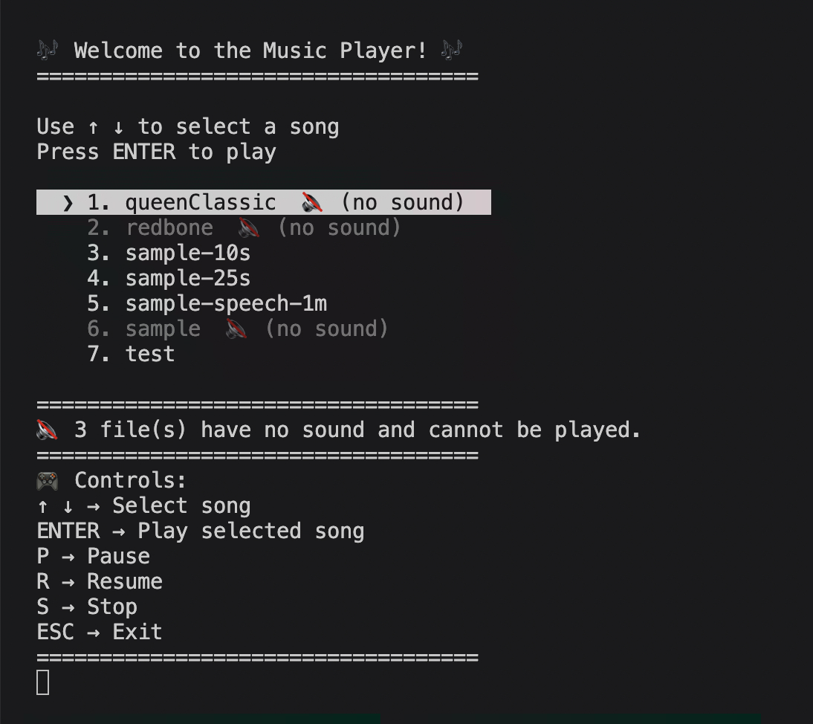
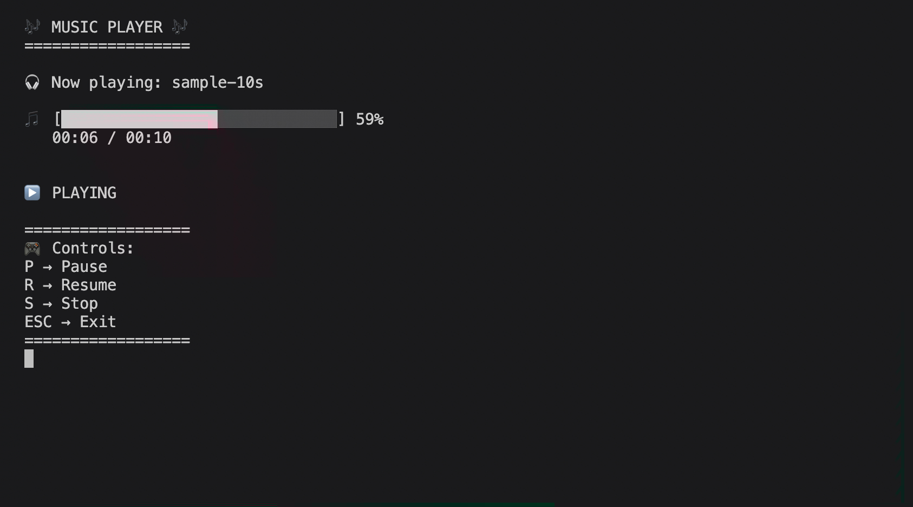

# Terminal Music Player 🎵

A simple terminal-based music player for macOS that plays MP3 files from a local `songs` folder. Navigate your playlist using arrow keys, play songs, pause/resume, stop, and exit—all from the command line.

### 🎵 Song Selection Menu


### ⏯️ Now Playing with Progress Bar


## Features

- Lists all `.mp3` files from the `songs` directory.
- Navigate the playlist with `↑` / `↓` arrow keys.
- Play a song by pressing `Enter` or typing its number.
- Pause / Resume / Stop playback with `P` / `R` / `S`.
- Exit anytime with `Esc` or `Ctrl + C`.
- Displays currently playing song and PID.

## Requirements

- **macOS** (uses the built-in `afplay` command).
- **Node.js** (any recent version).

## Setup

1. Clone the repository.
2. Create a folder named `songs` in the project root.
3. Add your `.mp3` files inside the `songs` folder.
4. Run the player:

```bash
node player.js